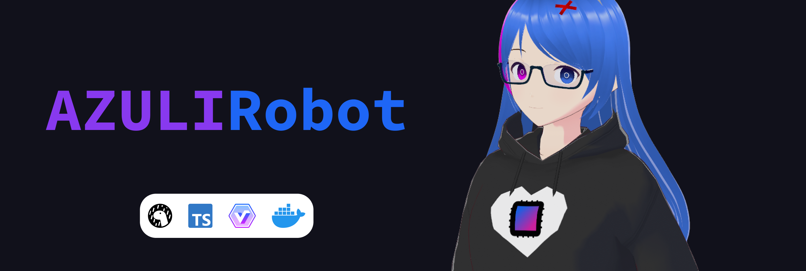

# AZULI the Robot

## Project Idea

AZULI (formerly Remilia) is a Discord bot based on my original character (OC) from 2018. The original name "Remilia" comes from merging two Re:Zero characters Rem and Emilia. The new name "AZULI robot" has been used since 2023 October 21, from Spanish "azul" and a backronym of "Asynchronous Zen Uncommercial Library-supported Integrated robot".

## Project Implementations

### The Python way (current)

- Programming language: Python
- Libraries:  [Interactions.py](https://interactions-py.github.io/interactions.py)
- Source code: [impl-python](../impl-python/)

| Command      | Description                                 |
| ------------ | ------------------------------------------- |
| pat          | Pat Remi                                    |
| echo         | Repeat what you said                        |
| spell        | Give a list of letters from your input word |
| tellremi     | Tell Remi                                   |
| calculate    | Calculate two numbers                       |
| trigonometry | Do trigonometry                             |
| factorial    | Calculate the factorial                     |
| randomnumber | Generate a random number                    |

### The Deno way (discontinued)

- Programming language: TypeScript (Deno)
- Libraries: [Harmony](http://harmony.mod.land)
- Source code: [impl-deno](../impl-deno/)

| Command       | Description                                         |
| ------------- | --------------------------------------------------- |
| ping          | Default ping command. Return Article 18 in the UDHR |
| spell         | Spell out the inputed word                          |
| quote         | Get a quote from ZenQuotes.io                       |
| calculate     | Do basic calculation                                |
| calculateTrig | Do trigonometry calculation                         |

## Stakeholders

+ Minh-Triet (Turito Yuenan)
	- Author and primary contributor
+ Minh-Thu (formerly Shannon)
	- Primary user, tester, and function suggestions
